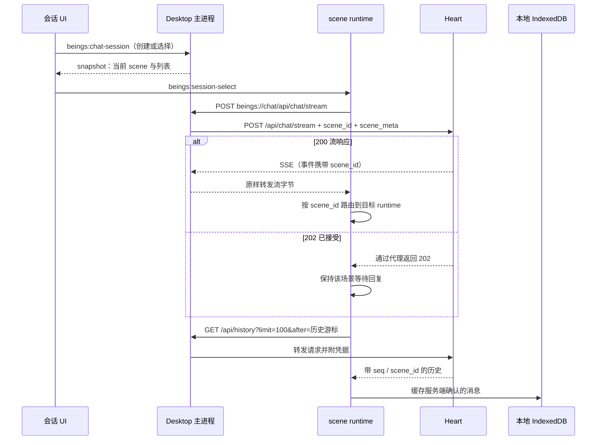

# 当前多会话 / 多场景调用链路

核对日期：2026-09-21。以当前 Town-Client 工作区实现为准；Heart 内部调度不在本仓库中，以下明确区分客户端实现、接口观测和待确认行为。

## 1. 身份与整体结构

UI 中一个会话对应一个 scene。隔离键是 `scene_id`，没有额外创建一套服务端 session 实体的接口。

| 标识 | 来源 | 当前用途 |
| --- | --- | --- |
| Being endpoint | 连接配置 | 区分 Being、本地会话目录与历史缓存 |
| scene_id | Desktop 主进程创建，格式 desktop-UUID | 消息场景归属、SSE 分流、历史过滤 |
| scene_meta | Desktop | client 与 scene_label；发送时随请求提交 |
| session_id | Heart 的 message_stop 可返回 | runtime 暂存，后续消息兼容性回传；不是 UI 会话主键 |
| stream_id | Heart | 标识流、恢复时核对流身份、停止流 |
| history seq | Heart history | 历史增量同步与去重 |
| replay seq | Heart 活动流 | 流事件恢复游标，与 history seq 不同 |

需要纠正一个容易混淆的表述：当前请求并非完全没有 session_id 字段。每个 scene runtime 保留 Heart 返回的 session_id 并可能回传；其 Heart 内部语义需服务端确认。客户端没有用它建立会话列表或 scene 映射。



## 2. 创建、切换、重命名和删除

入口是 `desktop/renderer/app/components/chat-scene.tsx`。

1. UI 调用 `AppModel.changeChatSession(operation, value, sceneId?)`。
2. preload 经 `ipcRenderer.invoke('beings:chat-session', ...)` 调用主进程。
3. 主进程核对连接 endpoint，在串行操作保护下调用 `ChatSessions.change()`。
4. `desktop/main/chat/scene.ts` 保存 `chat-sessions.json`：按 endpoint 分组，每组包含 `active` 和 `scenes`。采用临时文件加 rename 落盘，写入成功后更新内存。
5. 返回 snapshot，包含 `chatScene` 和 `chatSessions`。
6. AppModel 向聊天 iframe 发送 `beings:session-select`；`services/bridge.ts` 校验后调用 `runtime.selectScene({sceneId, sceneLabel, strict:true})`。
7. 协调器保存原场景草稿，选择或创建目标 runtime，切换显示范围并刷新历史。正常切换不会销毁 iframe，也不会主动取消原场景的请求。

创建时生成新 scene_id；重命名保留原 ID，目前只修改本地名称，后续发送携带新的 scene_meta。没有单独向 Heart 同步名称的接口。

删除目前只删除本机会话目录项，不调用 Heart 删除历史接口，也不清除 IndexedDB 历史。删除当前项会选择邻近项；删除最后一项会创建一个新的空场景。删除不是取消执行操作。

兼容文件 `chat-scene.json` 保存原始桌面场景 ID，用于默认场景迁移 / 回退。

## 3. 发送消息：如何绑定场景

代码：`services/scene-runtime.js` → `services/runtime.js` → `desktop/main/chat/proxy.ts`。

1. `send()` 委派给当前选中的 scene runtime；该 runtime 有独立的草稿、附件、流状态、回复等待状态和恢复状态。
2. runtime 建立带场景的本地用户消息，发送 `POST beings://chat/api/chat/stream`。
3. 请求头携带 `X-Portal-Being-Endpoint` 和 `X-Portal-Scene-Id`，用于校验请求身份，防止发送过程中切换 Being 或场景后串发。
4. 主进程代理在异步读取请求体之前捕获连接和当前 scene；发现期望 endpoint / scene 不一致则返回 409，不把请求静默改发到其他场景。
5. 主进程覆盖请求体中的 `scene_id`、`scene_meta`，以主进程捕获的场景为准，并附连接 token 转发给 Heart。

发送到 Heart 的请求结构示例：

```json
{
  "message": "用户输入",
  "scene_id": "desktop-UUID",
  "scene_meta": {
    "client": "portal-desktop/版本号",
    "scene_label": "测试A"
  },
  "session_id": "可选：Heart 先前返回的值",
  "attachments": [{ "media_type": "image/png", "data": "base64内容" }]
}
```

无附件时省略 attachments；普通发送没有 session_id 时省略该字段。场景协议字段不会拼入用户正文。

聊天 HTTP 请求由 Desktop 代理直接发往 Heart，不先经过 Rust Portal。Rust Portal 参与工具执行，是另一条链路。

## 4. Heart 接口与返回分支

| 方法 / 路径 | 当前客户端用途 | 场景边界 |
| --- | --- | --- |
| POST /api/chat/stream | 发送消息 / splice | 请求体携带 scene_id、scene_meta |
| GET /api/stream/active | 查询活动流 / 恢复 | 当前查询不传 scene_id；不能视为当前 UI 会话专属 |
| GET /api/stream/active?after=N | 增量回放流事件 | N 为 replay seq，事件再按 scene_id 分流 |
| GET /api/history?limit=100 | 初始历史对账 | 当前拉取 Being 历史，由客户端过滤场景 |
| GET /api/history?limit=100&after=N | 增量历史对账 | N 为 history seq |
| POST /api/stop | 停止流 | 请求体是 stream_id，不是 scene_id |
| GET /api/status | 连接 / 状态探测 | Being 级 |

主进程代理只透传白名单路由；查询参数白名单是 limit、after，并由主进程附加 token。它不解析 SSE 内容或重新标注 scene_id。

- **200 + 流**：进入 `consumeChatStream()` 持续读取。
- **202**：客户端视为已接受 / 排队，释放这次 POST 的读取状态，保留该 scene 的 pendingReply，并启动历史追赶。202 不是回复完成。
- **非成功状态**：显示该场景的请求错误。
- **同一 runtime 正在流式输出时再次发送**：走 `spliceSend()`，仍调用同一个聊天接口。若返回 200，客户端会实际消费新流，不能丢弃 response body；若返回 202，则等待后续回复。

客户端允许多个场景维持活动状态；Heart 究竟串行排队还是并行执行，不能从客户端 runtime 数量推断。

## 5. SSE 接收与 scene 分流

`createSceneRuntime()` 内维护 `Map<scene_id, runtime>`。各 runtime 的流文本、工具过程、AbortController、writerEpoch、stream_id、session_id 等独立；消息集合和历史同步由协调器共享。

读取顺序：

1. 将流字节解码并解析 `event:` / `data:`。
2. 更新传输层事件游标；初始 meta 不计入 replay 游标，`continuation:true` 的 meta 计入。
3. 核对 writerEpoch，防止旧 reader 在恢复后继续写消息。
4. **先依据 data.scene_id 分流，再修改正文、工具或结束状态。**
5. 有 scene_id 且不同于接收 runtime 的场景：创建 / 找到目标 runtime，调用 `acceptSceneEvent()`。
6. 无 scene_id：保留在当前处理该流的 runtime 中；因此服务端遗漏场景字段时，客户端不能可靠推断正确目标。显式 null 则按无场景历史处理，不等同于缺字段。
7. 各 runtime 生成带 scene 的消息项，UI 根据当前范围展示。左侧顶部“全部场景”是只读汇总入口，展示飞书、其他客户端等所有已接收场景的上下文；不改变当前桌面 scene_id，不把外部事件归到当前会话，不清除当前会话的未读回复提示。汇总视图禁止发送、附件修改和停止生成；选择具体会话后恢复操作，原草稿保留。
8. 回放连接本身不创建当前场景运行记录，只有归属于该场景的实际事件才建立运行状态。“全部场景”中的运行记录也标注场景名称。

| SSE 事件 | 客户端处理 |
| --- | --- |
| meta | 获取 stream_id；continuation 可表示同一传输中的场景切换 |
| content_block_delta | 从 delta.text 累积目标场景正文 |
| thinking / reasoning | 更新目标场景思考过程 |
| tool_use / tool_result | 更新目标场景工具调用过程 |
| message_stop | 固化本轮输出，检查该场景是否实际获得正文；可记录 session_id |
| error | 更新所属场景错误状态 |

同一传输流可以先后承载 A、B、C 的事件。传输连接结束与某一场景请求得到回复不是同一件事。

空 message_stop 或空 EOF 不作为已经回答的证据；该场景继续等待。其他场景的新正文不能完成它的等待。当前等待追赶有约 5 分钟上限，超时显示错误，不自动重发原消息。

## 6. 断线、恢复与停止

实时读取发生异常或检测到停滞时，runtime 探测 `/api/stream/active`：

- 活动 stream_id 相同且仍有事件：从已读 replay seq 请求 `?after=N`，交给同样的场景路由处理。
- 已读 seq 的事件跳过，使用响应中事件的 seq 推进游标。
- 活动流不存在、返回 204，或 stream_id 已被其他流替换：转向 `/api/history` 对账。
- 网络恢复时，历史 owner 协调已有 scene runtime 的恢复；不会把共享的活动流接口当作可靠的多场景队列列表。

恢复游标有两套：SSE replay seq 用来续流，history seq 用来补落盘消息，两者不能互换。

点击停止时，协调器调用当前选中 runtime 的 `stopCurrentTurn()`；有 currentStreamId 则发送：

```json
{ "stream_id": "Heart返回的流ID" }
```

然后取消该 runtime 的本地读取。**当前服务端调用是按流停止，没有按 scene_id 取消排队请求的独立接口。** 当多个场景共享同一个 Heart 流时，不能承诺服务端只停止选中场景。仅等待排队回复的 UI 不提供相同的流停止操作。

## 7. 历史存储和场景过滤

服务端：Heart `/api/history` 返回带 seq、role、content、scene_id 等字段的消息；服务端归属是对账依据。

本地有两层：

- profile 目录中的 `chat-sessions.json`：场景目录、名称、当前选择；不是正文历史。
- Electron IndexedDB：数据库名 `loom-history-${encodeURIComponent(规范化endpoint)}`；同一 Being 的所有场景共用 messages store，以 seq 为主键，每条记录保存 scene_id。另有 meta store 保存同步游标。

这里是“同库逐条带场景标签”，不是每个 scene 单独一个数据库。仅缓存服务端确认的历史，流中尚未落盘的思考 / 工具 UI 状态不是持久化备份。

启动可读最近 300 条本地缓存，再从 Heart 对账；网络初始查询 limit=100，后续按历史游标增量拉取。当前没有完整旧历史分页浏览链路，缓存数量不等于服务端全部历史数量。

历史对账由一个 owner 维护共享游标与去重，避免每个场景各自重复同步。正在输出的场景与已转为等待正文的场景分开处理，允许 history 补回后者的回复。

## 8. Being 跨场景回看：Portal 工具链

这条链路与聊天 SSE 分开：

```text
Heart / Being 调用 portal_exec(command="@context scene-id")
→ Portal Rust 读取调用 metadata 中的 scene_id
→ ToolHandler.call_with_scene()
→ @ 前缀分流，不执行 shell
→ ClientHandler / DesktopClientHandler
→ 经过鉴权的本机回环 HTTP bridge
→ Desktop ClientCommandServer
→ ClientContextReader（与聊天页保持相同顶层站点的隐藏窗口，内嵌 beings://chat iframe）
→ IndexedDB HistoryCache.context(scene_id, 50)
→ 格式化文本返回 Portal → Heart / Being
```

- `@context <scene_id>`：按精确 scene_id 返回最多最近 50 条本地缓存消息；省略参数时使用调用场景。输出另有字符数限制。
- `@scenes`：结合本地目录和缓存返回场景摘要；消息数和最后活跃时间只反映本地已有缓存。
- 不主动查询 Heart 全量历史，因此本机未缓存的内容不会凭空出现在结果中。
- 读取器必须与聊天 iframe 保持相同顶层站点：开发环境使用实际 Vite shell 地址，打包环境使用 beings://desktop/。仅 beings://chat 同源不足以共享 Chromium 分区存储。
- `scene_context()` 是 sub-agent 工作台接口，与 scene 对话历史回看独立。

## 9. 当前已知的 Heart 侧边界

2026-09-21 三场景实测：用户消息 history seq 11622、11623、11624 分别正确归属 A、B、C；A、B 收到无正文的 message_stop，随后 continuation 切换到 C。最终 assistant seq 11625 包含三个场景的测试标记，但整条归属 C。

该结果直接来自 Heart history；这轮自然结束且未调用 stop。它证明本次服务端处理 / 落盘不满足场景隔离，不能仅归类为 SSE 网络丢包。内部 splice 排队、上下文构造和 scene 绑定的具体根因仍待 Heart 查日志。

详见 [Heart 三场景回复归属异常报告](SCENE-SSE-REAL-TEST-2026-09-21.md)。客户端按 scene_id 分流无法纠正服务端已将多个场景回答合成一条 C 消息的情况。

## 10. 代码索引

| 环节 | 文件 |
| --- | --- |
| 会话浮窗 / 操作 | desktop/renderer/app/components/chat-scene.tsx |
| UI 到主进程、iframe 通知 | desktop/renderer/app/models/app.ts |
| IPC preload | desktop/preload/preload.ts |
| 主进程 IPC / 初始化 | desktop/main/main.ts |
| 会话目录 | desktop/main/chat/scene.ts |
| Heart HTTP / SSE 代理 | desktop/main/chat/proxy.ts |
| iframe 消息桥 | desktop/renderer/chat/services/bridge.ts |
| scene runtime 协调器 | desktop/renderer/chat/services/scene-runtime.js |
| 发送、SSE、恢复、历史对账 | desktop/renderer/chat/services/runtime.js |
| 场景解释 / 过滤 | desktop/renderer/chat/models/scenes.ts |
| IndexedDB 历史缓存 | desktop/renderer/chat/services/history-cache.ts |
| @context / @scenes 格式化 | desktop/renderer/chat/services/client-commands.ts |
| Desktop 工具桥 | desktop/main/chat/client-server.ts、client-context.ts |
| Portal @ 分流 / 客户端适配 | heart-portal/portal/src/tools/mod.rs、client.rs |

### 绑定其他客户端的场景

侧栏「新建会话」右侧的绑定图标打开独立的「绑定已有场景」弹窗，填写场景 ID 和本地名称，经 `changeChatSession('bind', name, endpoint, sceneId)` → preload → `beings:chat-session` → `ChatSessions.change` 写入当前 Being 的本地目录。ID 去除首尾空白并校验为 1–256 个非空白 ASCII 字符；不要求 `desktop-` 前缀。已有 ID 直接选中，保留已有名称，不重复创建。

绑定成功沿用普通会话切换链路：切换到当前场景视图，发送由主进程注入绑定的 ID，历史显示与 SSE 按此 ID 隔离。绑定本身不创建 Heart 资源，也不验证远端是否已有此 ID；共享要求各客户端连接同一 Being，ID 完全一致。历史仍受现有历史接口和本地缓存加载范围限制。删除仅移除本地目录项，不删除远端历史。

### 跨客户端同步现状

未启用周期性的空闲历史同步或活动流发现。启动、切换会话、重新获得焦点及连接恢复时沿用现有同步；已发现活动流的 replay 恢复机制保持不变。因此持续停留在窗口中时，其他客户端发起的新对话不保证自动出现。全局事件订阅接口仍需确认。

### Heart 调度约定与 Desktop 提示（2026-09-22）

根据 Heart 对接反馈，同一 Being 同时只有一个 breath；多场景输入通过 splice 入队，在工具边界触发 yield。Being 自主决定恢复原任务、处理新输入或委派 subagent。Desktop 的场景状态和 HTTP reader 不代表多个意识，也不能将 202、yield 或空的结束事件解释为任务完成。

Desktop 仅在 subagent 本地就绪检测通过时附加委派上下文（Portal 已连接、配置启用且模型存在、执行器可用、最近结束任务无已知失败；未知状态不宣称可用）。在实际发送时检查本机已提交且仍处于 thinking/replying/working/waiting 的其他场景，将场景 ID、名称、状态及最近提交请求的前 240 个字符（压缩空白）附在用户原文之后，最多 8 个场景。该段明确标记为「Desktop 场景调度提示」，随原始消息持久化，界面将其折叠在对应轮次的思考详情中；摘要仅是背景，委派仍由 Being 决定。闲置、已完成、仅通过外部事件发现的场景和未发送草稿不会加入提示。普通发送和在流中追加输入都使用此逻辑。未增加空闲轮询或自动 subagent 调用。

提示明确当前 Portal 已开启 subagent，三个会话中的任务独立、可能互不相关，摘要仅供调度。默认调度倾向已调整为：A 由主意识继续推进；新来的 B/C 若适合独立后台执行，优先评估委派本次新输入，再恢复 A。这是一条上下文建议，是否委派以及任务依赖的处理顺序仍由 Being 决定。提示要求委派携带新输入的 scene_id，后台结果回到 Being 后串行整理，并在各自 scene_id 输出，不能把 B/C 答案合并进 A 或当前会话。已有 subagent 的任务 ID 与状态也随提示提供，避免重复委派。

自动化协议回归覆盖 A 的工具执行、B 返回 202、A 空 stop/yield、B 回复以及 A 后续结果在原 SSE 上返回。真实 Being 是否委派仍需实机联调，自动化测试不代表已验证模型的委派决策。

### Desktop 初始化中的 subagent 配置

「连接与设置」的 subagent 配置入口复用现有模型设置组件。模型设置页区分 Heart 与 subagent：Heart 仍读写 `/api/llm/config`；subagent 读取本机配置的公开模型字段，密钥不回传。初始化时选择提供商、模型 ID、API Key 和思考强度，仅暂存在连接表单，返回后随连接保存；可取消本次配置。Being 模型与 subagent 在同一个右侧面板内切换，容器不重新打开，两套编辑草稿分别保留。尚未连接 Being 时仍可切换类别，Being 模型页提示先完成连接；subagent 可先配置。连接后可从模型设置页切换到 subagent，独立修改配置。

保存时先验证 Being 连接，再通过 Portal 的 `subagent-setup` 命令复用 `portal_subagent_setup` 安装与配置能力，成功后自动重启 Portal，无需手动重启 Desktop。需要本机 npm；安装失败可重试。配置成功不代表模型 API 凭据已经通过在线验证。subagent 仅展示支持的服务商，不沿用 Heart 的服务商密钥、自部署地址、温度或回滚参数。

配置 JSON 通过 stdin 传入，密钥不进入命令行或 Desktop 普通设置。Portal 将模型配置写入本机 TOML（权限 0600），后续启动沿用该文件；API Key 留空保留已有配置或使用运行环境。初始化不自动启动任务，是否委派仍由 Being 决定。


### subagent 模型列表与复用 Being 模型

subagent 页读取 Being 提供的模型预设，按已支持的接口协议生成可选模型；点击预设自动填入模型 ID。"使用 Being 当前模型"带入支持的当前公开模型 ID、接口地址和协议，确认密钥后保存。若 Being 使用自部署模型（`self-hosted`），该按钮禁用并提示为 subagent 单独选模型；自部署预设也不进入 subagent 列表，避免从列表绕过此限制。两类模型继续复用同一右侧设置面板和选择流程。它是配置复制，不是持续跟随 Being 模型变化。仅保存在 Being 服务端的密钥不会复制到本机；同一接口已有本机密钥可沿用，换服务商或地址时不继承旧密钥。

自定义配置保存为 `[subagent.model] provider="portal-custom"`，包含 `base_url` 与 `api`。Portal 在独立 pi agent 目录的 `models.json` 中维护 `portal-custom` 条目，保留其他条目，密钥以环境变量传递。兼容固定版本 pi 0.65.2 的[自定义模型配置协议](https://github.com/badlogic/pi-mono/blob/v0.65.2/packages/coding-agent/docs/models.md)。已通过该版本 pi 对本地模拟 OpenAI Chat Completions 服务的调用验证；未代替用户验证真实模型服务的凭据或兼容性。
